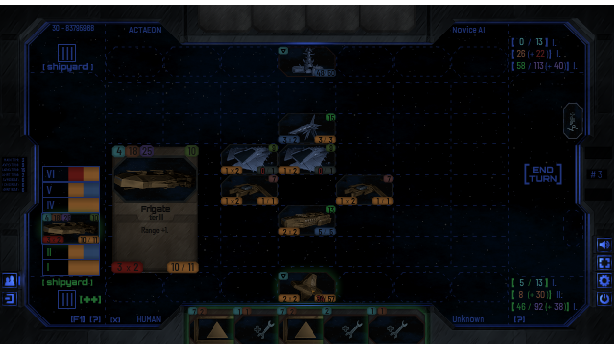
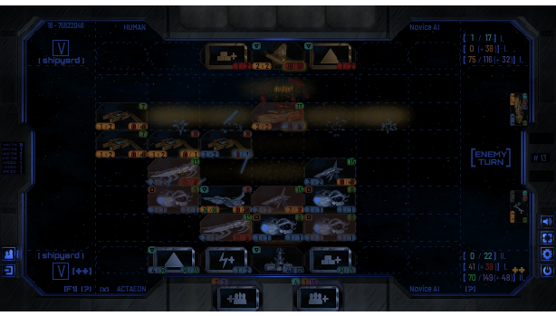
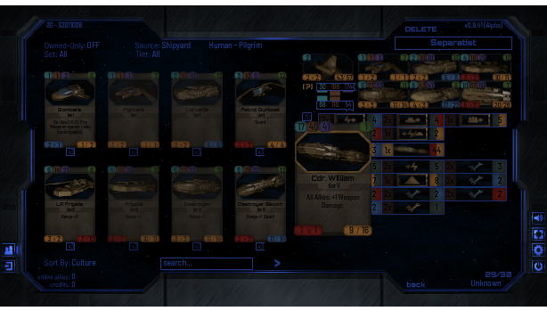

# Farstar: Exodus  
  
  
  
This is a FREE game.  
  
Installation package contains all the prerequisites.  
System must support Adobe Air ([see minimal requirements](https://uwm.edu/software/adobe-air-and-runtime-distribution/)) for the game to run.  
Server Application is not a part of Client's release.  
  
[WINDOWS RELEASE DOWNLOAD](https://github.com/Dark-Gran/Farstar-Exodus/releases/tag/1.0)  
  
Game can be played in offline-mode.  
Multiplayer also available over LAN.  
(Server State: :red_circle:)  
  
  
## Teaser-Texts (website archive)  
  
_Even with stars in our hands, the struggle never ends._  
  
_Mankind has disbanded into numerous nations, travelling the galaxy inside massive motherstations in a desperate effort to keep the population and its civilization alive, willing to sacrifice anything to earn the required energy and resources from various planets and stars._  
  
_And they are not alone - but only the strongest will gain the ultimate price: the survival of their species._  
  
~ ~ ~  
    
_Your people have chosen You to lead them through the stars in the infinite search for resources and new planets to colonize. There are many in the universe with the same goal however, and it falls onto You to protect Your civilization against any threats. Prepare Your fleet carefully, and be ready to react to anything the opponent brings to the table._  
  
Influenced by RTS PC games and table-top card games, FARSTAR: Exodus is an online collectible card game that brings much depth to the genre. Resources required to play cards are multiple and unforgiving: You must make sure that chosen strategy and politics work well with Your fleet and its abilities. Secondary mini-deck with six unique cards that are always available assures a much smaller impact of the starting hand and pushes the game towards a larger scale. Be ready to deploy Your ships into a 3x7 grid where their formation matters, as does the formation of enemy forces.  
After many strategic decisions, separate tactical battle comes: Pick targets carefully, as attacking shields of same colour reduces damage greatly - that is, if Your ships are even fast enough to get to attack in the first place.  
If You succeed... maybe Your people will find a new home one day.  
  
• Become a Commander of Your own star fleet as the game eases You into its rules in a storytelling tutorial.

• Collect over 270 cards from 5 different factions and build the ultimate deck: Will You be the predator, or defend humanity against alien threat?

• Compete against AI or other players online: Raise Your Reputation in a Quick Match, or invite Friends to a duel!

• Trade Cards with other players in real-time: Just like You would in a physical card-room!

• Play for Free, or support the game to speed up Your progress!
  
## Screenshots
  
  
  
  
  
## About Project  
  
In 2014, I have decided to focus on programming. Until then I've done only small personal projects and advertisement animations.  
  
I've been using Flash since I was 10 years old, so I have decided to stick with it for my first big coding project, as I was already familiar with Actionscript. Adobe Air as a cross-platform runtime solution only made the decision easier.  
  
Between 2014 and 2019 I've treated the game as a part-time job, and so the game went through 3 major rewrites, as I was learning to code better (the first version was mostly procedural) and often wanted to add more features.  
Function-wise I am rather proud of the final version, despite the fact it does contain one or two bugs, however the game mechanics themselves were barely tested. This was made clear to me in mere days after game's release, which was in April 2020.  
I have been lucky enough to find some testers to give me a very valuable feedback on the game, after which I have decided to pull the plug on the server.  
  
## What The Future Holds
  
The feedback was not entirely negative, so after few months I have rewritten the game on paper and played a paper-version with testers to ensure that the new version fits the new goal: not an experimental strategic-card-game code-learning project, but rather a fast-paced collectible card game with some simplified ideas from the old version.  
A basic prototype in Java, which I've started learning in the meantime, has already been written, to test the game mechanics on screen.  
  
Currently the Java version (called simply "Farstar 2") awaits a GUI and graphics update/import (game visuals should remain basically the same, although all illustrations will be, in fact, reworked to give the game slightly more "colorful looks"), however there many other features still missing as well (most of the cards included).  
  
_A link to the new version's git will be provided soon._  
  
  
