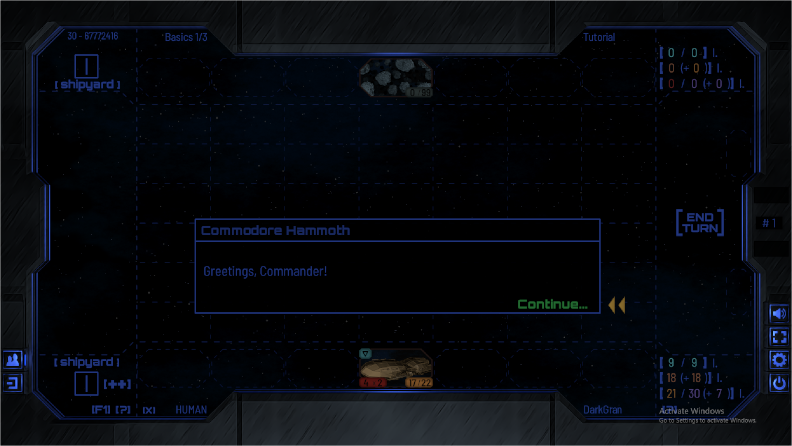

# Farstar: Exodus  
  
  
  
This is a FREE game.  
  
Installation package contains all the prerequisites.  
System must support Adobe Air ([see minimal requirements](https://uwm.edu/software/adobe-air-and-runtime-distribution/)) for the game to run.  
Server Application is not a part of Client's release.  
  
_WINDOWS RELEASE DOWNLOAD_  
  
Game can be played in offline-mode.  
Multiplayer also available over LAN.  
(Server State: :red_circle:)  
  
  
## Teaser-Texts (website archive)  
  
_Even with stars in our hands, the struggle never ends._  
  
_Mankind has disbanded into numerous nations, travelling the galaxy inside massive motherstations in a desperate effort to keep the population and its civilization alive, willing to sacrifice anything to earn the required energy and resources from various planets and stars._  
  
_And they are not alone - but only the strongest will gain the ultimate price: the survival of their species._  
  
~ ~ ~  
    
_Your people have chosen You to lead them through the stars in the infinite search for resources and new planets to colonize. There are many in the universe with the same goal however, and it falls onto You to protect Your civilization against any threats. Prepare Your fleet carefully, and be ready to react to anything the opponent brings to the table._  
  
Influenced by RTS PC games and table-top card games, FARSTAR: Exodus is an online collectible card game that brings much depth to the genre. Resources required to play cards are multiple and unforgiving: You must make sure that chosen strategy and politics work well with Your fleet and its abilities. Secondary mini-deck with six unique cards that are always available assures a much smaller impact of the starting hand and pushes the game towards a larger scale. Be ready to deploy Your ships into a 3x7 grid where their formation matters, as does the formation of enemy forces.  
After many strategic decisions, separate tactical battle comes: Pick targets carefully, as attacking shields of same colour reduces damage greatly - that is, if Your ships are even fast enough to get to attack in the first place.  
If You succeed... maybe Your people will find a new home one day.  
  
  
## Screenshots
  
  
  
  
  
  
## About Project  
  
...  
  
  
